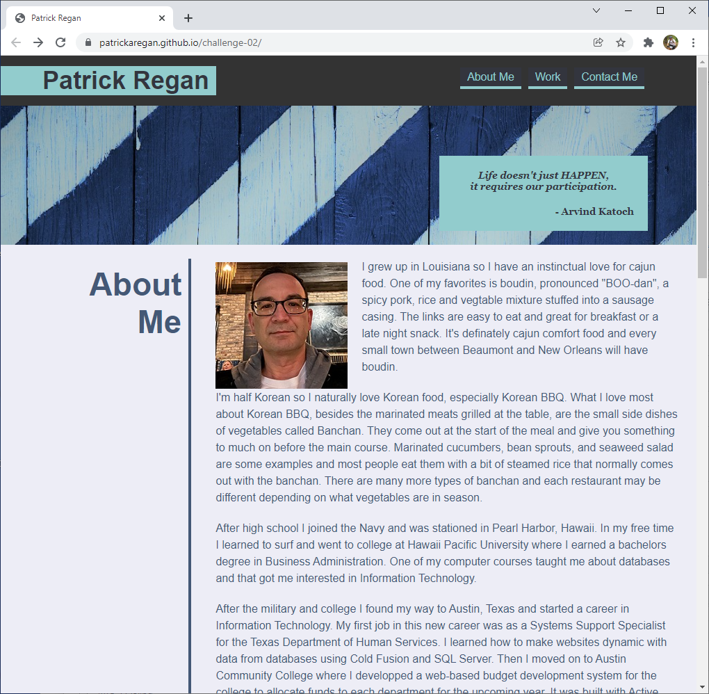

# patrickaregan.github.io/challenge-02/

## Description
- This project is my portfolio website. It tells the reader a little bit about me,
then shows examples of my work and lists multiple ways to contact me.
- A portfolio website is necessary to show potential employers what your work is like so they
can tell if you have the right skillset to join their team.
- I learned a lot about CSS in class and I'm putting it to use here. Some specific things I learned
are flexbox and media queries.
- I used flexbox to position elements like the navbar and the headers for the main sections. Flexbox makes it easy to position and space elements inside a container and it lets them change position when the screen gets smaller.
- I used media queries to change the layout for smaller screens. On larger screens the headers are to the left
of the content but for smaller screens I changed the flex-direction property to column and put the headers above each section's content. This makes it more readable on smaller screens.

## Screenshot

## Link
[https://patrickaregan.github.io/challenge-02/](https://patrickaregan.github.io/challenge-02/)

## Credits

Arvind Katoch. (December 31, 2021). Quote about Active Participation.
Retrieved December 31, 2021,
from [https://www.quotemaster.org/activity+participation](https://www.quotemaster.org/activity+participation)

David Bartus. (December 30, 2021). License free background images.
Retrieved December 30, 2021,
from [https://www.pexels.com/photo/white-and-black-wooden-board-963278/](https://www.pexels.com/photo/white-and-black-wooden-board-963278/)

